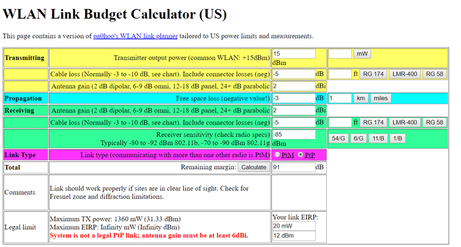
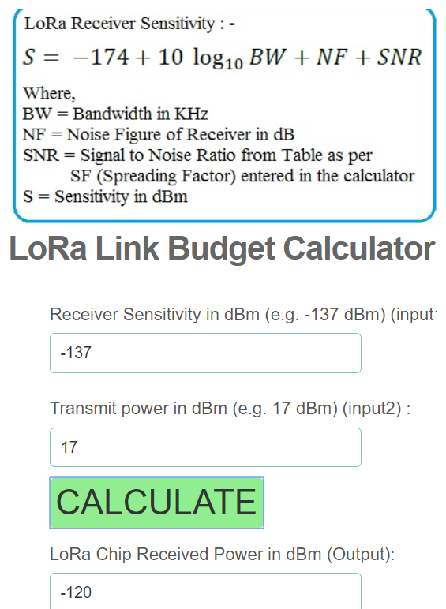

# Lora
## What is the relation bandwidth/range/power?
LoRa uses license-free sub-gigahertz radio frequency bands like 433 MHz, 868 MHz (Europe) and 915 MHz (Australia and North America). LoRa enables long-range transmissions (more than 10 km in rural areas) with low power consumption

## What is the link budget?
In telecommunications, the power transmission budget is a measure of the quality of a transmission channel. The balance is given in the unit Bel (with positive or negative values) and is calculated in a simple model by adding the transmission power, the receiver sensitivity, the antenna gain and the free space attenuation. Part of the power transmission balance is formed by the Friis transmission equation.

## What is the community approach?
he Things Network has a strong close-knit communities present around the world.
## What are benefits with LORA?
+ The LoRa physical layer utilizes ISM bands 868 and 915 MHz — frequencies that are free to use anywhere in the world.
+ LoRa devices consume very little power making it ideal for battery-powered devices
+ It can transmit and receive data for up to 15 km in suburban areas and 5 km in urban areas.
## what are problems with LORA?
+ It can be used for applications requiring low data rate i.e. upto about 27 Kbps.
+ LoRaWAN network size is limited based on parameter called as duty cycle. It is defined as percentage of time during which the channel can be occupied. This parameter arises from the regulation as key limiting factor for traffic served in the LoRaWAN network.
+ It is not ideal candidate to be used for real time applications requiring lower latency and bounded jitter requirements.

## WLAN Link Budget Calculator?
2 + 15 -5 = 12 db
Antenna + Transmitter Output Power - Cable Loss

## Cost of a LORA Gateway?
Lora gateway : 500 €

## What are the advantages of ESP-Now in comparison to LORA

+ works everywhere
+ no router
+ saves much energy
+ way faster
+ 5.6 x more battery

## What are the disadvantages of ESP-Now in comparison to LORA

+ higher spreading factor – lower battery life
max 20 nodes
+ message size < 250 bytes

## How could this be integrated with/into IoTempower?
+ Public Libraries , collaborated with lora communities
## What do you think yourself is the more interesting option (for what kind of projects)?
LORA for low powered long range devices

