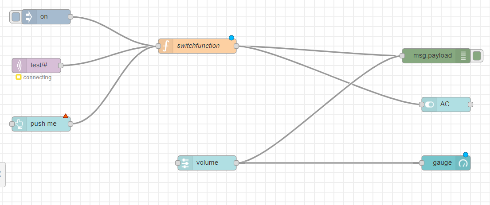
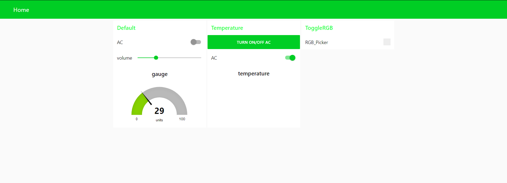

# Node-red


## State function
````
var state = context.get("toggle_state");
if (msg.payload === "on") {
	if(state === 1) {
		state = 0;
	} else {
		state = 1;
	}
	context.set("toggle_state", state);
}
msg.payload = state;
return msg;
````
## 2 small scenario ideas where such interfaces could be used
+ watching the temperature in your room on a screen
+ a whole dashboard for a system like a smarthome (turning on/off lights and AC, open/close windows ...) 
